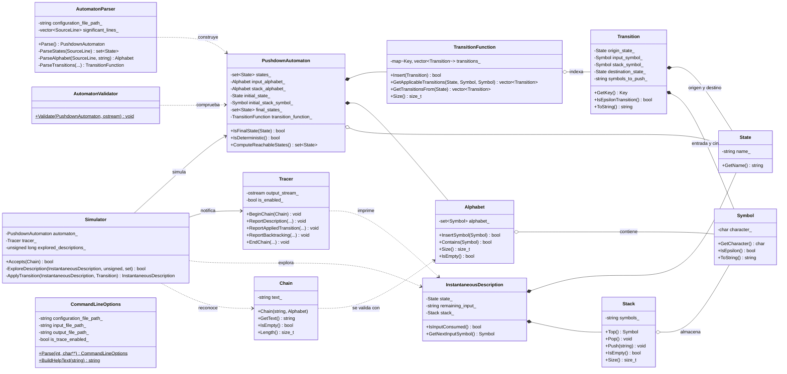
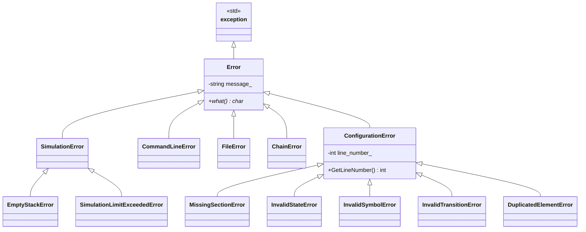
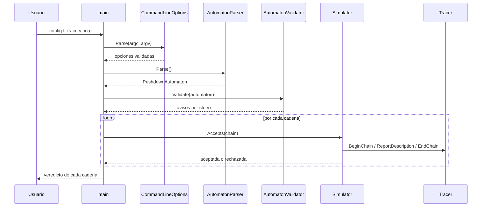

# Práctica 1 — Simulador de un autómata con pila

**Asignatura:** Complejidad Computacional · **Curso:** 3.º · **Año académico:** 2026/27
**Autor:** Álvaro Pérez Ramos — `alu0101574042@ull.edu.es`
**Escuela Superior de Ingeniería y Tecnología · Universidad de La Laguna**

---

## 1. Tipo de autómata implementado

> **El simulador implementa un autómata con pila con finalización por ESTADO FINAL (APf).**

Una cadena `w` pertenece al lenguaje reconocido si existe alguna secuencia de transiciones que,
partiendo de la descripción instantánea `(q0, w, Z0)`, consuma la cadena por completo y alcance un
estado del conjunto `F`. **El contenido final de la pila es irrelevante.**

Por tanto, el fichero de configuración **debe incluir la línea del conjunto `F`**. Si se le
proporciona un fichero pensado para un autómata por vaciado de pila (APv, sin esa línea), el
programa lo detecta y lo indica expresamente en lugar de fallar con un error confuso.

---

## 2. Compilación y ejecución

### Requisitos

| Herramienta | Versión mínima                      |
| ----------- | ----------------------------------- |
| CMake       | 3.16                                |
| Compilador  | C++17 (g++ 9 / clang 10 o superior) |

### Compilación

```bash
cmake -S . -B build      # configuración (build fuera del árbol de fuentes)
cmake --build build      # compilación
```

El ejecutable se genera en `build/bin/pda_simulator`.

> Si no se dispone de CMake, el proyecto compila igualmente en un solo paso:
> `g++ -std=c++17 -Wall -Wextra -Wpedantic -Iinclude src/*.cc -o pda_simulator`

### Ejecución

```
./build/bin/pda_simulator -config <f> -trace <y|n> [-in <f>] [-out <f>]
```

| Opción          | Obligatoria | Descripción                                                               |
| --------------- | ----------- | ------------------------------------------------------------------------- |
| `-config <f>`   | Sí          | Fichero de texto con la definición del autómata.                          |
| `-trace <y\|n>` | Sí          | Activa (`y`) o desactiva (`n`) el modo traza.                             |
| `-in <f>`       | No          | Fichero con las cadenas a comprobar. Si se omite, se leen por teclado.    |
| `-out <f>`      | No          | Fichero donde se almacena la traza. Si se omite, se muestra por pantalla. |
| `-h`, `--help`  | No          | Muestra la ayuda y termina.                                               |

Ejemplos:

```bash
# Cadenas desde fichero, traza por pantalla
./build/bin/pda_simulator -config tests/correctos/anbn.pda -trace y -in tests/cadenas/anbn.txt

# Cadenas por teclado, sin traza
./build/bin/pda_simulator -config tests/correctos/palindromos_pares.pda -trace n

# Traza volcada a fichero
./build/bin/pda_simulator -config tests/correctos/parentesis.pda -trace y \
                          -in tests/cadenas/parentesis.txt -out traza.txt
```

En el modo teclado, `.` representa la cadena vacía y `exit` (o `Ctrl+D`) termina el programa.

---

## 3. Formato del fichero de configuración

```
# Las líneas en blanco y el texto que sigue a '#' se ignoran
q1 q2 q3        # conjunto Q
a b             # conjunto Sigma   (un carácter por símbolo)
S A             # conjunto Gamma   (un carácter por símbolo)
q1              # estado inicial q0
S               # símbolo inicial de la pila Z0
q3              # conjunto F  (obligatorio: el simulador es APf)
q1 a S q1 AS    # transición: (q1, AS) pertenece a delta(q1, a, S)
q1 . A q2 .     # una transición por línea
```

Convenios:

- El carácter `.` representa a **ε**, tanto en el símbolo de entrada como en la secuencia a apilar.
  Por ese motivo `.` **no puede** pertenecer a `Σ` ni a `Γ`.
- El campo de símbolos a apilar se escribe **sin espacios** (`AAA` apila tres símbolos, quedando el
  primero en la cima).
- El símbolo de la cima consultado por una transición debe ser siempre un símbolo concreto de `Γ`:
  una transición nunca consulta `ε`.

---

## 4. Diseño orientado a objetos

### 4.1 Diagrama de clases



### 4.2 Jerarquía de excepciones



### 4.3 Flujo de ejecución



### 4.4 Responsabilidad de cada clase

| Clase                      | Responsabilidad                                                       |
| -------------------------- | --------------------------------------------------------------------- |
| `Symbol`                   | Símbolo de un alfabeto; encapsula el convenio de representación de ε. |
| `State`                    | Estado del autómata, identificado por su nombre.                      |
| `Alphabet`                 | Conjunto finito de símbolos (`Σ` o `Γ`).                              |
| `Chain`                    | Cadena de entrada validada contra `Σ` en el momento de construirse.   |
| `Stack`                    | Pila del autómata; la posición 0 es la cima.                          |
| `Transition`               | Una quíntupla de `δ`.                                                 |
| `TransitionFunction`       | La función `δ` completa, indexada por `(estado, símbolo, cima)`.      |
| `PushdownAutomaton`        | La séptupla `(Q, Σ, Γ, δ, q0, Z0, F)` y sus consultas estructurales.  |
| `InstantaneousDescription` | La terna `(q, w, α)`: situación del autómata en un instante.          |
| `Simulator`                | Algoritmo de reconocimiento con retroceso.                            |
| `Tracer`                   | Formato y destino de la traza.                                        |
| `AutomatonParser`          | Lectura y análisis sintáctico del fichero de configuración.           |
| `AutomatonValidator`       | Comprobaciones semánticas que producen avisos, no errores.            |
| `CommandLineOptions`       | Análisis y validación de los argumentos del programa.                 |

Dos decisiones de diseño merecen justificarse:

1. **El reconocimiento no vive en `PushdownAutomaton`, sino en `Simulator`.** El autómata es una
   estructura de datos inmutable y consultable; la simulación necesita estado mutable (contadores,
   conjunto de descripciones visitadas) y un destino de traza. Separarlos evita que el autómata
   arrastre estado propio de una ejecución concreta.
2. **El estado inicial y los estados finales pertenecen al autómata, no a la clase `State`.** En la
   práctica de Computabilidad y Algoritmia de la que parte este código, `State` guardaba los
   indicadores `is_initial_` e `is_final_`; eso permite que dos copias del mismo estado discrepen
   sobre si son finales. Aquí la pertenencia a `F` se consulta siempre en el autómata.

---

## 5. Algoritmo de reconocimiento

Un autómata con pila no determinista no puede simularse avanzando un conjunto de estados, como se
hacía con los autómatas finitos: **cada rama de la computación arrastra su propia pila**. El
simulador realiza por ello una **búsqueda en profundidad con retroceso** sobre el árbol de
descripciones instantáneas:

```
ExploreDescription(q, w, alfa):
    si (w = ε) y (q pertenece a F):        --> ACEPTAR
    T = delta(q, primer_simbolo(w), cima(alfa))  union  delta(q, ε, cima(alfa))
    para cada t en T:
        si ExploreDescription(aplicar(t)):  --> ACEPTAR
    --> retroceder
```

Como un AP puede contener ciclos de ε-transiciones que apilan sin consumir entrada, la exploración
incorpora tres salvaguardas que convierten un cuelgue en un error legible:

| Salvaguarda                               | Límite        | Motivo                                             |
| ----------------------------------------- | ------------- | -------------------------------------------------- |
| Descripciones repetidas en la rama actual | —             | Poda los ciclos que no modifican la configuración. |
| Tamaño de la pila                         | 1000 símbolos | Detecta el apilado indefinido.                     |
| Descripciones exploradas por cadena       | 200 000       | Cota global de trabajo.                            |
| Profundidad de la recursión               | 2000          | Evita el desbordamiento de la pila del proceso.    |

Al superarse cualquiera de ellas se lanza `SimulationLimitExceededError`, se informa de la cadena
afectada y **el programa continúa con la siguiente**.

### Ejemplo de traza

```
================================================================================
 Traza del reconocimiento de la cadena: aabb
================================================================================
ID   Prof. Estado    Cadena          Pila            Transiciones aplicables
--------------------------------------------------------------------------------
1    0     p         aabb            S               δ(p, a, S) ∋ (p, AS)
           -> se aplica δ(p, a, S) ∋ (p, AS)
2    1     p         abb             AS              δ(p, a, A) ∋ (p, AA)
            -> se aplica δ(p, a, A) ∋ (p, AA)
3    2     p         bb              AAS             δ(p, b, A) ∋ (q, ε)
             -> se aplica δ(p, b, A) ∋ (q, ε)
...
--------------------------------------------------------------------------------
 Cadena aabb: ACEPTADA tras explorar 6 descripciones instantáneas.
================================================================================
```

Cada fila muestra el **estado**, la **cadena pendiente**, la **pila** y las **transiciones
aplicables**, tal y como exige el enunciado. Las líneas `-> se aplica` y `<- retroceso` permiten
seguir el recorrido del árbol de exploración del autómata no determinista.

---

## 6. Gestión de errores

Los errores **abortan** la carga del autómata; los avisos (`[Aviso]`) sólo informan y la ejecución
continúa. Todos los errores del fichero de configuración indican el **número de línea real** del
fichero, comentarios y líneas en blanco incluidos.

### Línea de comandos

| Situación                                 | Tratamiento                       |
| ----------------------------------------- | --------------------------------- |
| Falta `-config` o `-trace`                | Error + ayuda                     |
| Opción repetida                           | Error                             |
| Opción sin valor                          | Error                             |
| Valor de `-trace` distinto de `y`/`n`     | Error                             |
| Opción desconocida                        | Error                             |
| Fichero de `-config` o `-in` inaccesible  | Error                             |
| Fichero de `-out` no creable              | Error                             |
| `-out` junto a `-trace n`                 | Error (el fichero quedaría vacío) |
| `-out` coincide con un fichero de entrada | Error (se destruiría)             |

### Fichero de configuración

| Situación                                             | Excepción                                        |
| ----------------------------------------------------- | ------------------------------------------------ |
| Fichero vacío o inaccesible                           | `FileError`                                      |
| El fichero termina antes de una sección obligatoria   | `MissingSectionError`                            |
| Fichero sin línea `F` (formato APv)                   | `MissingSectionError` con diagnóstico específico |
| `Q` vacío, `Σ` vacío o `Γ` vacío                      | `MissingSectionError`                            |
| Estado repetido en `Q` o en `F`                       | `DuplicatedElementError`                         |
| Símbolo repetido en `Σ` o en `Γ`                      | `DuplicatedElementError`                         |
| Símbolo de más de un carácter                         | `InvalidSymbolError`                             |
| El carácter `.` declarado en `Σ` o `Γ`                | `InvalidSymbolError`                             |
| Más de un estado inicial o más de un `Z0`             | `MissingSectionError`                            |
| `q0 ∉ Q`, `F ⊄ Q`                                     | `InvalidStateError`                              |
| `Z0 ∉ Γ`                                              | `InvalidSymbolError`                             |
| Transición con un número de campos distinto de 5      | `InvalidTransitionError`                         |
| Estado de origen o destino no declarado               | `InvalidTransitionError`                         |
| Símbolo de entrada que no está en `Σ ∪ {ε}`           | `InvalidTransitionError`                         |
| Cima consultada que no está en `Γ`                    | `InvalidTransitionError`                         |
| Secuencia a apilar con símbolos ajenos a `Γ`          | `InvalidTransitionError`                         |
| Secuencia a apilar que mezcla `.` con símbolos de `Γ` | `InvalidTransitionError`                         |

### Avisos

| Situación                                | Motivo                                  |
| ---------------------------------------- | --------------------------------------- |
| Transición duplicada                     | Se ignora la repetición                 |
| Autómata sin ninguna transición          | Sólo podría aceptar `ε`                 |
| Estado inalcanzable desde `q0`           | Estado inútil                           |
| Ningún estado de `F` alcanzable          | El lenguaje reconocido es vacío         |
| `Σ ∩ Γ ≠ ∅`                              | Legal, pero casi siempre es un descuido |
| No hay transición aplicable a `(q0, Z0)` | El autómata se detiene al arrancar      |

### Cadenas de entrada

| Situación                      | Tratamiento                                       |
| ------------------------------ | ------------------------------------------------- |
| Símbolo ajeno a `Σ`            | Error de esa cadena; se continúa con la siguiente |
| Límite de exploración superado | Error de esa cadena; se continúa con la siguiente |

---

## 7. Batería de pruebas

### Autómatas correctos (`tests/correctos/`)

| Fichero                 | Lenguaje reconocido                   | Determinista |
| ----------------------- | ------------------------------------- | ------------ |
| `anbn.pda`              | `{aⁿbⁿ : n ≥ 1}`                      | Sí           |
| `palindromos_pares.pda` | `{w·wᴿ : w ∈ {a,b}*}`                 | No           |
| `parentesis.pda`        | Secuencias de paréntesis equilibradas | No           |
| `igual_numero_a_b.pda`  | `{w ∈ {a,b}* :                        | w            | ₐ = | w | _b}` | No |

Cada uno tiene su fichero de cadenas homónimo en `tests/cadenas/`, con casos aceptados y rechazados.

### Autómatas con errores (`tests/errores/`)

| Fichero                                     | Caso que comprueba                            |
| ------------------------------------------- | --------------------------------------------- |
| `error_01_estado_duplicado.pda`             | Estado repetido en `Q`                        |
| `error_02_simbolo_multicaracter.pda`        | Símbolo de `Σ` de más de un carácter          |
| `error_03_epsilon_en_alfabeto.pda`          | `.` declarado dentro de `Σ`                   |
| `error_04_estado_inicial_no_declarado.pda`  | `q0 ∉ Q`                                      |
| `error_05_varios_estados_iniciales.pda`     | Dos estados iniciales                         |
| `error_06_simbolo_pila_no_declarado.pda`    | `Z0 ∉ Γ`                                      |
| `error_07_estado_final_no_declarado.pda`    | `F ⊄ Q`                                       |
| `error_08_transicion_campos.pda`            | Transición con 4 campos                       |
| `error_09_simbolo_entrada_no_declarado.pda` | Símbolo de entrada ajeno a `Σ`                |
| `error_10_cima_no_declarada.pda`            | Cima ajena a `Γ`                              |
| `error_11_apilar_simbolo_no_declarado.pda`  | Se apila un símbolo ajeno a `Γ`               |
| `error_12_destino_no_declarado.pda`         | Estado destino no declarado                   |
| `error_13_fichero_incompleto.pda`           | Fichero truncado                              |
| `error_14_formato_apv.pda`                  | Fichero en formato APv                        |
| `error_15_transicion_duplicada.pda`         | Aviso de transición repetida                  |
| `error_16_ciclo_epsilon.pda`                | Ciclo de ε-transiciones y estado inalcanzable |

Comprobación rápida de toda la batería:

```bash
for f in tests/errores/*.pda; do
  echo "--- $f"
  ./build/bin/pda_simulator -config "$f" -trace n -in tests/cadenas/anbn.txt 2>&1 | head -2
done
```

---

## 8. Estructura del proyecto

Se sigue la disposición estándar descrita en
[*Organizing a C++ Project*](https://www.studyplan.dev/cmake/organizing-a-cpp-project): cabeceras
públicas en `include/`, implementación en `src/`, compilación fuera del árbol de fuentes en
`build/`, pruebas en `tests/` y documentación en `docs/`.

```
p01_pushdown_automaton/
├── CMakeLists.txt
├── README.md
├── include/
│   └── pda/                         # Cabeceras públicas: #include "pda/<fichero>.h"
│       ├── alphabet.h
│       ├── automaton_parser.h
│       ├── automaton_validator.h
│       ├── chain.h
│       ├── command_line_options.h
│       ├── errors.h
│       ├── instantaneous_description.h
│       ├── pushdown_automaton.h
│       ├── simulator.h
│       ├── stack.h
│       ├── state.h
│       ├── symbol.h
│       ├── tracer.h
│       ├── transition.h
│       └── transition_function.h
├── src/                             # Implementación + main
│   ├── alphabet.cc
│   ├── automaton_parser.cc
│   ├── automaton_validator.cc
│   ├── chain.cc
│   ├── command_line_options.cc
│   ├── main.cc
│   ├── pushdown_automaton.cc
│   ├── simulator.cc
│   ├── stack.cc
│   ├── symbol.cc
│   ├── tracer.cc
│   ├── transition.cc
│   └── transition_function.cc
├── tests/
│   ├── correctos/                   # Autómatas válidos
│   ├── errores/                     # Autómatas que ejercitan la gestión de errores
│   └── cadenas/                     # Ficheros de cadenas de entrada
├── docs/
│   └── CC_2627_Practica1.pdf        # Enunciado de la práctica
└── build/                           # Generado por CMake (no se versiona)
```

El código se compila como una biblioteca estática `pda_core` enlazada por el ejecutable
`pda_simulator`, de modo que la lógica del autómata queda separada del punto de entrada y podría
reutilizarse desde un futuro programa de pruebas unitarias.

---

## 9. Referencias

1. Material de la asignatura Complejidad Computacional, Universidad de La Laguna (Moodle).
2. Hopcroft, J. E.; Motwani, R.; Ullman, J. D. *Introduction to Automata Theory, Languages, and
   Computation*, 3.ª ed., capítulo 6: *Pushdown Automata*.
3. [*Organizing a C++ Project*](https://www.studyplan.dev/cmake/organizing-a-cpp-project) — STUDYPLAN.dev.
4. [Google C++ Style Guide](https://google.github.io/styleguide/cppguide.html), seguida en la
   nomenclatura y la disposición del código.