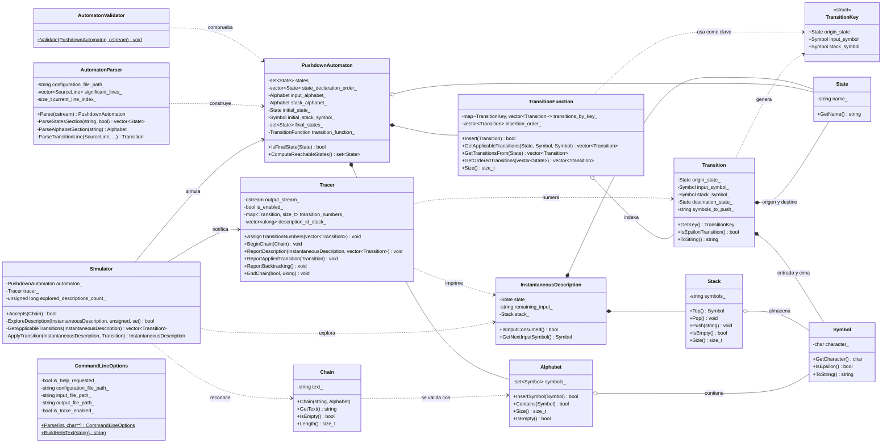
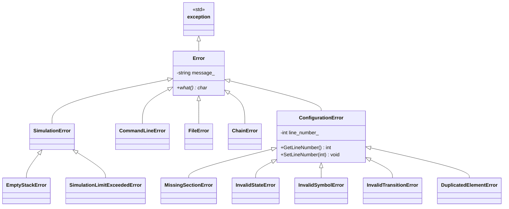
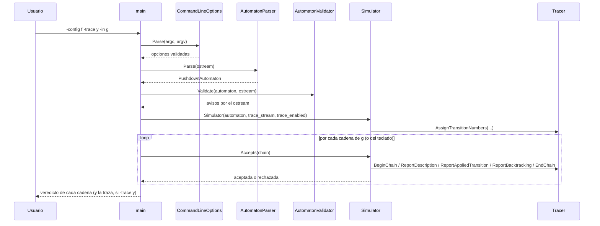

# Práctica 1 — Simulador de un autómata con pila

**Asignatura:** Complejidad Computacional · **Curso:** 4.º · **Año académico:** 2026/27
**Autor:** Álvaro Pérez Ramos — `alu0101574042@ull.edu.es`
**Escuela Superior de Ingeniería y Tecnología · Universidad de La Laguna**

---

## 1. Tipo de autómata implementado

> **El simulador implementa un autómata con pila con finalización por ESTADO FINAL (APf).**

Una cadena `w` pertenece al lenguaje reconocido si existe alguna secuencia de transiciones que,
partiendo de la descripción instantánea `(q0, w, Z0)`, consuma la cadena por completo y alcance un
estado del conjunto `F`. **El contenido final de la pila es irrelevante.**

Por tanto, el fichero de configuración **debe incluir la línea del conjunto `F`**. Si se le
proporciona un fichero pensado para un autómata por vaciado de pila (APv, sin esa línea), el
programa lo detecta con una heurística (ver §6) y lo indica expresamente en lugar de fallar con un
error confuso.

⚠️ Diseñar un autómata para APf no es solo "quitar la comprobación de pila vacía" de un APv: si tu
autómata alcanza un estado que solo pretendías usar como marca intermedia, con la entrada ya
consumida, **se dará por aceptado aunque la pila tenga cualquier cosa dentro**. Un caso típico es un
autómata que reconoce `{w·wᴿ}` adivinando el punto medio con una ε-transición: si el estado al que se
llega tras adivinar es el mismo que el de aceptación final, el simulador aceptará cadenas que no son
palíndromos (aceptó "antes de tiempo"). La solución es tener un estado de aceptación *distinto*, que
solo se alcanza cuando se ha vuelto a ver `Z0` en la cima (es decir, cuando de verdad se ha desapilado
todo lo que se apiló). Ver `test/APf/APf-2.txt` para el ejemplo correcto.

---

## 2. Compilación y ejecución

### Requisitos

| Herramienta | Versión mínima                      |
| ----------- | ----------------------------------- |
| CMake       | 3.10                                |
| Compilador  | C++17 (g++ 9 / clang 10 o superior) |

### Compilación

```bash
cmake -S . -B build      # configuración (build fuera del árbol de fuentes)
cmake --build build      # compilación
```

El ejecutable se genera en `build/bin/automata_pila`.

> Si no se dispone de CMake, el proyecto compila igualmente en un solo paso:
> `g++ -std=c++17 -Wall -Wextra -Iinclude src/*.cc -o automata_pila`

### Ejecución

```
./build/bin/automata_pila -config <f> -trace <y|n> [-in <f>] [-out <f>]
```

| Opción          | Obligatoria | Descripción                                                                     |
| --------------- | ----------- | ------------------------------------------------------------------------------- |
| `-config <f>`   | Sí          | Fichero de texto con la definición del autómata.                                |
| `-trace <y\|n>` | Sí          | Activa (`y`) o desactiva (`n`) el modo traza.                                   |
| `-in <f>`       | No          | Fichero con las cadenas a comprobar. Si se omite, se leen por teclado.          |
| `-out <f>`      | No          | Fichero donde se almacena la traza. Si se omite, se muestra por pantalla.       |
| `-h`, `--help`  | No          | Muestra la ayuda y termina (se resuelve antes que cualquier otra comprobación). |

Ejemplos:

```bash
# Cadenas por teclado, con traza por pantalla
./build/bin/automata_pila -config test/APf/APf-1.txt -trace y

# Cadenas desde fichero, sin traza
./build/bin/automata_pila -config test/APf/APf-2.txt -trace n -in cadenas.txt

# Traza volcada a fichero
./build/bin/automata_pila -config test/APf/APf-3.txt -trace y -in cadenas.txt -out traza.txt
```

En el modo teclado, `.` representa la cadena vacía y `exit` (o `Ctrl+D`) termina el programa.

---

## 3. Formato del fichero de configuración

```
# Las líneas en blanco y el texto que sigue a '#' se ignoran
q1 q2 q3        # conjunto Q
a b             # conjunto Sigma   (un carácter por símbolo)
S A             # conjunto Gamma   (un carácter por símbolo)
q1              # estado inicial q0
S               # símbolo inicial de la pila Z0
q3              # conjunto F  (obligatorio: el simulador es APf)
q1 a S q1 AS    # transición: (q1, AS) pertenece a delta(q1, a, S)
q1 . A q2 .     # una transición por línea
```

Convenios:

- El carácter `.` representa a **ε**, tanto en el símbolo de entrada como en la secuencia a apilar.
  Por ese motivo `.` **no puede** pertenecer a `Σ` ni a `Γ`.
- El campo de símbolos a apilar se escribe **sin espacios** (`AAA` apila tres símbolos, quedando el
  primero en la cima).
- El símbolo de la cima consultado por una transición debe ser siempre un símbolo concreto de `Γ`:
  una transición nunca consulta `ε`.

---

## 4. Diseño orientado a objetos

### 4.1 Diagrama de clases



`AutomatonParser` tiene más métodos privados que los mostrados (uno por sección del fichero:
`ParseInitialStateSection`, `ParseInitialStackSymbolSection`, `ParseFinalStatesSection`,
`CheckNoDuplicateStates`...); el diagrama solo lista una muestra representativa. El detalle completo
está en `include/automaton_parser.h`.

### 4.2 Jerarquía de excepciones



`ConfigurationError` nace normalmente sin línea fijada (-1): la clase que detecta el problema
(`Alphabet`, por ejemplo) no siempre sabe en qué línea del fichero está. `AutomatonParser`, que sí lo
sabe, captura la excepción y llama a `SetLineNumber()` antes de dejarla seguir propagándose — por eso
todo mensaje de error que llega a consola incluye siempre el número de línea real.

### 4.3 Flujo de ejecución



### 4.4 Responsabilidad de cada clase

| Clase                      | Responsabilidad                                                                                                                                                           |
| -------------------------- | ------------------------------------------------------------------------------------------------------------------------------------------------------------------------- |
| `Symbol`                   | Símbolo de un alfabeto; encapsula el convenio de representación de ε (`.`).                                                                                               |
| `State`                    | Estado del autómata, identificado por su nombre.                                                                                                                          |
| `Alphabet`                 | Conjunto finito de símbolos; se usa tanto para `Σ` como para `Γ`.                                                                                                         |
| `Chain`                    | Cadena de entrada validada contra `Σ` en el momento de construirse.                                                                                                       |
| `Stack`                    | Pila del autómata; la posición 0 es la cima.                                                                                                                              |
| `Transition`               | Una quíntupla de `δ`.                                                                                                                                                     |
| `TransitionFunction`       | La función `δ` completa: indexada por clave para `Simulator`, y en orden de fichero para numerar la traza.                                                                |
| `PushdownAutomaton`        | La séptupla `(Q, Σ, Γ, δ, q0, Z0, F)`; estructura de datos inmutable, no valida nada.                                                                                     |
| `InstantaneousDescription` | La terna `(q, w, α)`: situación del autómata en un instante. Inmutable.                                                                                                   |
| `Simulator`                | Algoritmo de reconocimiento con retroceso (§5); construye y usa su propio `Tracer`.                                                                                       |
| `Tracer`                   | Formato y destino de la traza: IDs de descripción, numeración de transiciones, agrupación de retrocesos.                                                                  |
| `AutomatonParser`          | Lee el fichero **y** valida todo lo que la sección 6 trata como error (incluidas las referencias cruzadas entre `Q`/`Σ`/`Γ`). Fija el número de línea real de cada error. |
| `AutomatonValidator`       | Los avisos que necesitan el autómata ya construido: alcanzabilidad, `Σ ∩ Γ`, etc. Nunca aborta.                                                                           |
| `CommandLineOptions`       | Análisis y validación de los argumentos del programa.                                                                                                                     |

Decisiones de diseño que merecen justificarse:

1. **El reconocimiento no vive en `PushdownAutomaton`, sino en `Simulator`.** El autómata es una
   estructura de datos inmutable y consultable; la simulación necesita estado mutable (contadores,
   descripciones visitadas) y un destino de traza. Separarlos evita que el autómata arrastre estado
   propio de una ejecución concreta.
2. **El estado inicial y los finales pertenecen al autómata, no a `State`.** Así dos copias del mismo
   estado nunca pueden discrepar sobre si son iniciales o finales.
3. **`AutomatonParser` valida las referencias cruzadas (`q0 ∈ Q`, `Z0 ∈ Γ`, `F ⊆ Q`, estados/símbolos
   de cada transición), no `AutomatonValidator`.** Puede hacerlo sin esperar al autómata completo:
   cuando lee `q0` ya conoce `Q` (se leyó antes); cuando lee cada transición ya conoce `Q`, `Σ` y `Γ`
   enteros. `AutomatonValidator` solo hace falta para lo que sí necesita el grafo de transiciones
   completo (alcanzabilidad, `F` alcanzable...), y por eso solo emite avisos, nunca errores: la
   frontera entre las dos clases es "¿necesito el autómata ya construido, o me basta lo leído hasta
   ahora?", no "¿es grave o no?".
4. **`Tracer` numera cada descripción explorada (no solo las transiciones) con un ID propio,
   incremental.** Esto permite que un retroceso, o varios seguidos sin nada interesante en medio, se
   impriman como una única línea ("de la descripción X a la Y") en vez de una línea por cada paso: al
   ID de destino le basta con ser el que queda en la cima de la pila interna de IDs tras retirar todos
   los intermedios. Por el mismo motivo, cuando una descripción solo tiene una transición aplicable,
   `Tracer` omite el aviso de "se aplica" (no hay ninguna decisión que anunciar, es un paso mecánico).

---

## 5. Algoritmo de reconocimiento

Un autómata con pila no determinista no puede simularse avanzando un conjunto de estados, como se
hacía con los autómatas finitos: **cada rama de la computación arrastra su propia pila**. El
simulador realiza por ello una **búsqueda en profundidad con retroceso** sobre el árbol de
descripciones instantáneas:

```
ExploreDescription(q, w, alfa):
    si (w = ε) y (q pertenece a F):        --> ACEPTAR
    T = delta(q, primer_simbolo(w), cima(alfa))  union  delta(q, ε, cima(alfa))
    para cada t en T:
        si ExploreDescription(aplicar(t)):  --> ACEPTAR
    --> retroceder
```

Como un AP puede contener ciclos de ε-transiciones que apilan sin consumir entrada, la exploración
incorpora salvaguardas que convierten un cuelgue en un error legible:

| Salvaguarda                               | Límite        | Motivo                                             |
| ----------------------------------------- | ------------- | -------------------------------------------------- |
| Descripciones repetidas en la rama actual | —             | Poda los ciclos que no modifican la configuración. |
| Tamaño de la pila                         | 1000 símbolos | Detecta el apilado indefinido.                     |
| Descripciones exploradas por cadena       | 200 000       | Cota global de trabajo.                            |
| Profundidad de la recursión               | 2000          | Evita el desbordamiento de la pila del proceso.    |

Al superarse cualquiera de ellas se lanza `SimulationLimitExceededError`, se informa de la cadena
afectada y **el programa continúa con la siguiente**.

### Ejemplo de traza

Cada descripción explorada recibe un ID; las filas muestran **ID, estado, cadena pendiente, pila y
transiciones aplicables** (por su número, ya calculado por `TransitionFunction::GetOrderedTransitions`).
Cuando solo hay una transición aplicable no se anuncia "se aplica" (no hay elección real); un
retroceso, o varios seguidos, se imprimen como una sola línea que dice a qué ID se vuelve:

```
================================================================================
 Traza del reconocimiento de la cadena: aabb
================================================================================
ID: 1    Estado: q1    Cadena pendiente: aabb    Pila: S    Transiciones aplicables: 1
ID: 2    Estado: q1    Cadena pendiente: abb    Pila: AS    Transiciones aplicables: 2
ID: 3    Estado: q1    Cadena pendiente: bb    Pila: AAS    Transiciones aplicables: 3
ID: 4    Estado: q2    Cadena pendiente: b    Pila: AS    Transiciones aplicables: 4
ID: 5    Estado: q2    Cadena pendiente: ε    Pila: S    Transiciones aplicables: 5
ID: 6    Estado: q3    Cadena pendiente: ε    Pila: S    Transiciones aplicables: ninguna
--------------------------------------------------------------------------------
 Cadena ACEPTADA tras explorar 5 descripciones instantáneas.
================================================================================
```

Y un caso con retroceso real (no determinista), donde se ve la línea agrupada:

```
ID: 4    Estado: l3    Cadena pendiente: a    Pila: S    Transiciones aplicables: 5
ID: 5    Estado: l4    Cadena pendiente: a    Pila: S    Transiciones aplicables: ninguna
  <- retroceso: de la descripción 5 a la 1
  -> se aplica la transición 2: δ(p, a, S) ∋ (q, S)
```

---

## 6. Gestión de errores

Los errores **abortan** la carga del autómata; los avisos (`[Aviso]`) sólo informan y la ejecución
continúa. Todos los errores del fichero de configuración indican el **número de línea real** del
fichero, comentarios y líneas en blanco incluidos.

### Línea de comandos

| Situación                                | Tratamiento                                                      |
| ---------------------------------------- | ---------------------------------------------------------------- |
| Falta `-config` o `-trace`               | Error + ayuda                                                    |
| Opción repetida                          | Error + ayuda                                                    |
| Opción sin valor                         | Error + ayuda                                                    |
| Valor de `-trace` distinto de `y`/`n`    | Error + ayuda                                                    |
| Opción desconocida                       | Error + ayuda                                                    |
| Fichero de `-config` o `-in` inaccesible | Error                                                            |
| Fichero de `-out` no creable             | Error                                                            |
| `-out` junto a `-trace n`                | Error (el fichero quedaría vacío)                                |
| `-out` coincide con `-config` o `-in`    | Error (se destruiría)                                            |
| `-h`, `--help`                           | Muestra la ayuda; no es un error, se resuelve antes que el resto |

Todas las excepciones de esta tabla son `CommandLineError`.

### Fichero de configuración

| Situación                                                 | Excepción                                        |
| --------------------------------------------------------- | ------------------------------------------------ |
| Fichero vacío o inaccesible                               | `FileError`                                      |
| El fichero termina antes de una sección obligatoria       | `MissingSectionError`                            |
| Fichero sin línea `F` (formato APv, detección heurística) | `MissingSectionError` con diagnóstico específico |
| `Q` vacío                                                 | `MissingSectionError`                            |
| Estado repetido en `Q` o en `F`                           | `DuplicatedElementError`                         |
| Símbolo repetido en `Σ` o en `Γ`                          | `DuplicatedElementError`                         |
| Símbolo de más de un carácter                             | `InvalidSymbolError`                             |
| El carácter `.` declarado en `Σ` o `Γ`                    | `InvalidSymbolError`                             |
| Más de un estado inicial o más de un `Z0`                 | `MissingSectionError`                            |
| `q0 ∉ Q`, `F ⊄ Q`                                         | `InvalidStateError`                              |
| `Z0 ∉ Γ`                                                  | `InvalidSymbolError`                             |
| Transición con un número de campos distinto de 5          | `InvalidTransitionError`                         |
| Estado de origen o destino no declarado                   | `InvalidTransitionError`                         |
| Símbolo de entrada que no está en `Σ ∪ {ε}`               | `InvalidTransitionError`                         |
| Cima consultada que no está en `Γ` (o es `ε`)             | `InvalidTransitionError`                         |
| Secuencia a apilar con símbolos ajenos a `Γ`              | `InvalidTransitionError`                         |
| Secuencia a apilar que mezcla `.` con símbolos de `Γ`     | `InvalidTransitionError`                         |

> La detección de formato APv es una heurística (§1, §7): si la línea de `F` tiene exactamente 5
> tokens y no todos son ya estados declarados en `Q`, se interpreta como la primera transición de un
> fichero sin línea de `F`. Un `F` genuino de exactamente 5 estados, todos declarados, no la dispara.

### Avisos

| Situación                                | Motivo                                  | Quién lo detecta     |
| ---------------------------------------- | --------------------------------------- | -------------------- |
| Transición duplicada                     | Se ignora la repetición                 | `AutomatonParser`    |
| Autómata sin ninguna transición          | Sólo podría aceptar `ε`                 | `AutomatonValidator` |
| Estado inalcanzable desde `q0`           | Estado inútil                           | `AutomatonValidator` |
| Ningún estado de `F` alcanzable          | El lenguaje reconocido es vacío         | `AutomatonValidator` |
| `Σ ∩ Γ ≠ ∅`                              | Legal, pero casi siempre es un descuido | `AutomatonValidator` |
| No hay transición aplicable a `(q0, Z0)` | El autómata se detiene al arrancar      | `AutomatonValidator` |

La transición duplicada es la única que se detecta línea a línea, mientras se lee el fichero (no hace
falta el autómata completo); el resto necesita el grafo de transiciones ya construido.

### Cadenas de entrada

| Situación                      | Tratamiento                                                          |
| ------------------------------ | -------------------------------------------------------------------- |
| Símbolo ajeno a `Σ`            | `ChainError`; se descarta esa cadena y se continúa                   |
| Límite de exploración superado | `SimulationLimitExceededError`; se descarta esa cadena y se continúa |

---

## 7. Batería de pruebas

`test/` contiene ficheros de configuración organizados por el tipo de autómata que describen, no por
el tipo de error que ejercitan (a diferencia de lo planteado inicialmente en este documento):

### `test/APf/` — autómatas con finalización por estado final (el tipo que implementa esta práctica)

| Fichero     | Lenguaje reconocido                                                                 | Determinista |
| ----------- | ----------------------------------------------------------------------------------- | ------------ |
| `APf-1.txt` | `{aⁿbⁿ : n > 0}`                                                                    | Sí           |
| `APf-2.txt` | `{w·wᴿ : w ∈ {0,1}*}` (palíndromos de longitud par)                                 | No           |
| `APf-3.txt` | Automatiza con estado de aceptación separado del de "adivinar" (ver el aviso de §1) | No           |

### `test/APv/` — los mismos autómatas, pero en formato de vaciado de pila (sin línea de `F`)

Sirven para comprobar la detección de formato APv de §6: al no llevar línea de `F`, `AutomatonParser`
debe rechazarlos con el diagnóstico específico, no con un error confuso.

| Fichero     | Correspondiente en `test/APf/` |
| ----------- | ------------------------------ |
| `APv-1.txt` | `APf-1.txt` (aⁿbⁿ)             |
| `APv-2.txt` | `APf-2.txt` (palíndromos)      |
| `APv-3.txt` | `APf-3.txt`                    |

Comprobación rápida:

```bash
for f in test/APv/*.txt; do
  echo "--- $f"
  ./build/bin/automata_pila -config "$f" -trace n < /dev/null
done
```

> Esta batería cubre la distinción APf/APv y un caso no determinista real, pero no ejercita todavía,
> uno por uno, cada error concreto de la tabla de §6 (símbolo repetido, transición con campos de más,
> etc.). Ampliarla con un fichero por fila de esa tabla queda como trabajo pendiente.

---

## 8. Estructura del proyecto

Este directorio (`practica_1/`) es una de las prácticas del repositorio `Complejidad-Computacional`;
sigue la disposición estándar descrita en
[*Organizing a C++ Project*](https://www.studyplan.dev/cmake/organizing-a-cpp-project): cabeceras en
`include/`, implementación en `src/`, compilación fuera del árbol de fuentes en `build/`, pruebas en
`test/` y el enunciado en `docs/`.

```
practica_1/
├── CMakeLists.txt
├── AutomataPila.md
├── include/                         # #include "<fichero>.h" (o "../include/<fichero>.h" desde src/)
│   ├── alphabet.h
│   ├── automaton_parser.h
│   ├── automaton_validator.h
│   ├── chain.h
│   ├── command_line_options.h
│   ├── errors.h
│   ├── instantaneous_description.h
│   ├── pushdown_automaton.h
│   ├── simulator.h
│   ├── stack.h
│   ├── state.h
│   ├── symbol.h
│   ├── tracer.h
│   ├── transition.h
│   └── transition_function.h
├── src/                             # Implementación + main (symbol.cc no existe: su operator<< va inline en symbol.h)
│   ├── alphabet.cc
│   ├── automaton_parser.cc
│   ├── automaton_validator.cc
│   ├── chain.cc
│   ├── command_line_options.cc
│   ├── instantaneous_description.cc
│   ├── main.cc
│   ├── pushdown_automaton.cc
│   ├── simulator.cc
│   ├── stack.cc
│   ├── tracer.cc
│   ├── transition.cc
│   └── transition_function.cc
├── test/
│   ├── APf/                         # Autómatas APf (el tipo implementado)
│   └── APv/                         # Los mismos, en formato APv (para probar su rechazo)
├── docs/
│   └── CC_2627_Practica1 - CC_2627_Practica1.pdf   # Enunciado de la práctica
└── build/                           # Generado por CMake (no se versiona)
```

A diferencia de un planteamiento inicial de este documento, no existe una biblioteca estática
separada (`pda_core`): todos los `.cc` de `src/` se compilan directamente en el único ejecutable
`automata_pila`, generado en `build/bin/`.

---

## 9. Referencias

1. Material de la asignatura Complejidad Computacional, Universidad de La Laguna (Moodle).
2. Hopcroft, J. E.; Motwani, R.; Ullman, J. D. *Introduction to Automata Theory, Languages, and
   Computation*, 3.ª ed., capítulo 6: *Pushdown Automata*.
3. [*Organizing a C++ Project*](https://www.studyplan.dev/cmake/organizing-a-cpp-project) — STUDYPLAN.dev.
4. [Google C++ Style Guide](https://google.github.io/styleguide/cppguide.html), seguida en la
   nomenclatura y la disposición del código.