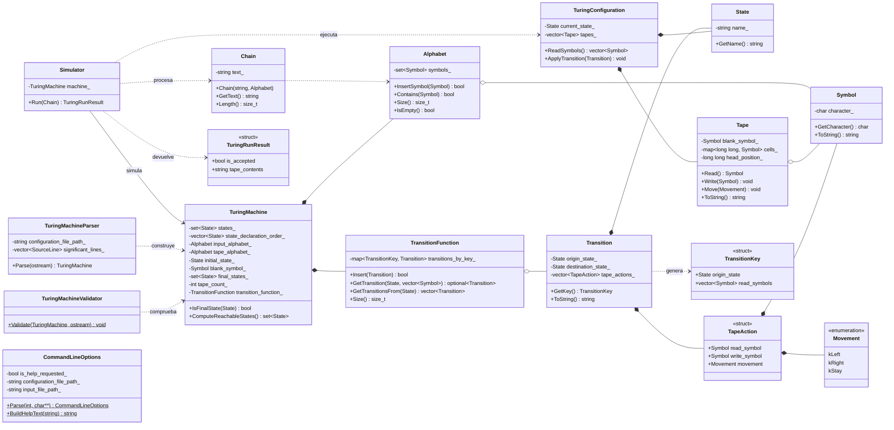
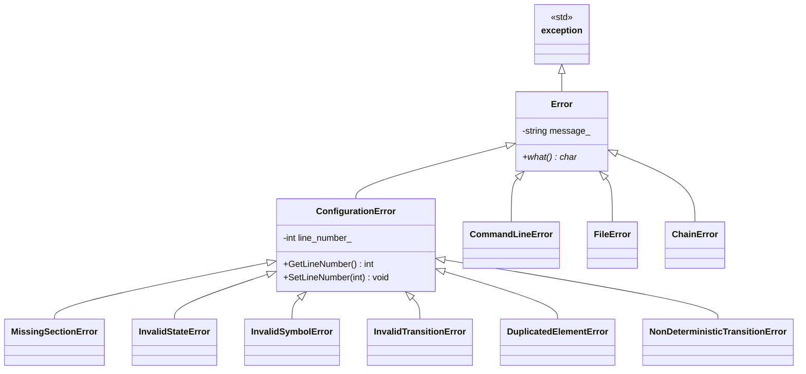
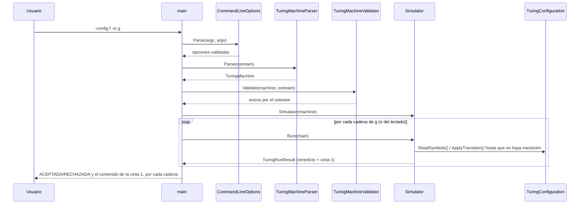
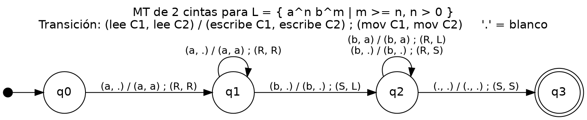
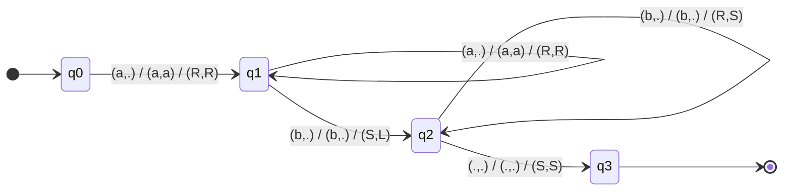
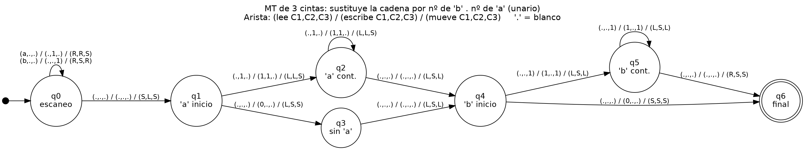
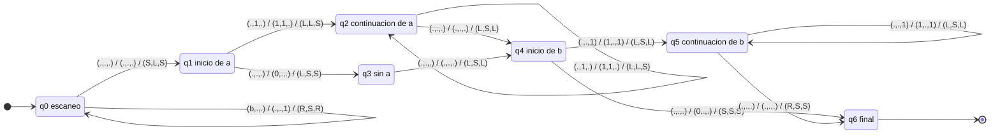

# Práctica 2 — Simulador de una Máquina de Turing

**Asignatura:** Complejidad Computacional · **Curso:** 4.º · **Año académico:** 2026/27
**Autor:** Álvaro Pérez Ramos — `alu0101574042@ull.edu.es`
**Escuela Superior de Ingeniería y Tecnología · Universidad de La Laguna**

---

## 1. Tipo de Máquina de Turing implementada

> **MT multicinta determinista**, donde la ejecución termina únicamente por ausencia de transiciones
> (no hay un límite de pasos: si la MT no termina, el simulador tampoco).

De las tres variaciones que el enunciado obliga a elegir:

| Variación              | Elección                                                     |
| ---------------------- | ------------------------------------------------------------ |
| Escritura y movimiento | **Simultáneos** (una transición hace las dos cosas a la vez) |
| Movimientos permitidos | **L, R y S** (incluye "sin mover")                           |
| Dirección de la cinta  | **Infinita en ambas direcciones** (MT tradicional)           |

Una cadena se acepta si, al detenerse (ninguna transición aplicable), el estado alcanzado
pertenece a `F`. El contenido final de la cinta 1 se muestra siempre, se acepte o no.

---

## 2. Compilación y ejecución

### Requisitos

| Herramienta | Versión mínima                      |
| ----------- | ----------------------------------- |
| CMake       | 3.10                                |
| Compilador  | C++17 (g++ 9 / clang 10 o superior) |

### Compilación

```bash
cmake -S . -B build
cmake --build build
```

El ejecutable se genera en `build/bin/maquina_turing`.

### Ejecución

```
./build/bin/maquina_turing -config <f> [-in <f>]
```

| Opción         | Obligatoria | Descripción                                                                     |
| -------------- | ----------- | ------------------------------------------------------------------------------- |
| `-config <f>`  | Sí          | Fichero de texto con la configuración de la MT.                                 |
| `-in <f>`      | No          | Fichero con las cadenas a comprobar. Si se omite, se leen por teclado.          |
| `-h`, `--help` | No          | Muestra la ayuda y termina (se resuelve antes que cualquier otra comprobación). |

A diferencia de P01, no hay `-trace` ni `-out`: el enunciado de esta práctica no los pide. La
salida, para cada cadena, es siempre la misma: `ACEPTADA`/`RECHAZADA` y el contenido de la cinta 1
con el cabezal entre corchetes (p. ej. `ab[c]d`).

```bash
./build/bin/maquina_turing -config test/Ejemplo1_MT.txt
./build/bin/maquina_turing -config test/Ejemplo2_MT.txt -in cadenas.txt
```

---

## 3. Formato del fichero de configuración

```
# Las líneas en blanco y el texto que sigue a '#' se ignoran
q0 q1 q2        # conjunto Q
0 1             # conjunto Sigma
0 1 .           # conjunto Gamma (un carácter por símbolo)
q0              # estado inicial
.               # símbolo blanco (debe pertenecer a Gamma, y NO a Sigma)
q2              # conjunto F
1               # número de cintas (N)
q0 0 q1 0 R     # transición con N=1: origen lee destino escribe movimiento
```

Con `N` cintas, cada transición agrupa los campos **por tipo**, no por cinta:

```
origen  lee_1 .. lee_N  destino  escribe_1 .. escribe_N  mov_1 .. mov_N
```

Ejemplo con `N=2` (la cinta 2 recibe una copia de lo que hay en la cinta 1):

```
q0 a . q0 a a R R
```

Convenios:

- El símbolo blanco se declara en su propia línea, **después** de `Σ` y `Γ`: debe pertenecer a `Γ`
  (la cinta necesita poder representarlo) y **no** puede pertenecer a `Σ` (no es un símbolo de
  entrada válido).
- No existe convenio de ε en las transiciones: cada transición consulta siempre un símbolo concreto
  en cada cinta.
- **Cadena vacía de entrada:** se escribe como el símbolo blanco de la MT (p. ej. `.`) o dejando la
  línea vacía. No es ambiguo: el blanco nunca pertenece a `Σ`, así que no puede ser un símbolo de
  entrada real. Si la MT declara otro blanco (p. ej. `_`), es `_` el que denota la cadena vacía.
- Los movimientos válidos son `L`, `R` y `S`.
- Inicialmente, la cinta 1 contiene la cadena de entrada con el cabezal en su primer símbolo; el
  resto de las cintas (si `N>1`) están completamente en blanco, con el cabezal en la posición 0.

---

## 4. Diseño orientado a objetos

### 4.1 Diagrama de clases



### 4.2 Jerarquía de excepciones



Sin `SimulationError`: al no haber backtracking ni límite de pasos, no hay nada parecido al
desbordamiento de pila o al límite de exploración de P01 que proteger.

### 4.3 Flujo de ejecución



### 4.4 Responsabilidad de cada clase

| Clase                    | Responsabilidad                                                                                      |
| ------------------------ | ---------------------------------------------------------------------------------------------------- |
| `Symbol`                 | Símbolo de un alfabeto. Sin convenio de ε: no existe en una MT.                                      |
| `State`                  | Estado, identificado por su nombre.                                                                  |
| `Alphabet`               | Conjunto finito de símbolos; se usa para `Σ` y para `Γ` (un único `Γ` para todas las cintas).        |
| `Chain`                  | Cadena de entrada validada contra `Σ`; el blanco solo (o texto vacío) es la cadena vacía.            |
| `Movement`               | Enumerado `{L, R, S}`.                                                                               |
| `TapeAction`             | Lo que una transición hace sobre **una** cinta: símbolo leído, símbolo a escribir, movimiento.       |
| `Tape`                   | Cinta infinita bidireccional; mapa disperso posición→símbolo, el resto se asume blanco.              |
| `Transition`             | `(origen, destino, [TapeAction])`, una acción por cinta.                                             |
| `TransitionFunction`     | La función `δ` completa; determinista: una única `Transition` por clave.                             |
| `TuringMachine`          | La séptupla `(Q, Σ, Γ, s, b, F, δ)` + número de cintas. Inmutable, no valida nada.                   |
| `TuringConfiguration`    | Estado + cintas en un instante. **Mutable** (sin backtracking no hace falta inmutabilidad).          |
| `TuringRunResult`        | Veredicto + contenido final de la cinta 1, ya formateado.                                            |
| `Simulator`              | Bucle de ejecución: aplica la única transición aplicable hasta que no quede ninguna.                 |
| `TuringMachineParser`    | Lee el fichero y valida todo lo que aborta la carga (mismo patrón que `AutomatonParser` de P01).     |
| `TuringMachineValidator` | Avisos que necesitan la MT completa: sin transiciones, estado inalcanzable, ningún final alcanzable. |
| `CommandLineOptions`     | Analiza y valida `-config`/`-in`/`-h`.                                                               |

### 4.5 Decisiones de diseño

1. **`TapeAction` agrupa lectura, escritura y movimiento de una misma cinta en una sola estructura**,
   en vez de tres vectores paralelos (`vector<Symbol> lee`, `vector<Symbol> escribe`,
   `vector<Movement> mueve`). Con vectores paralelos nada garantiza que los tres tengan la misma
   longitud ni que la posición *i* de cada uno se refiera a la misma cinta; con `TapeAction`, esa
   invariante la impone la propia estructura, no la disciplina de quien escribe el código.
2. **`TransitionFunction` indexa una única `Transition` por clave**, a diferencia de
   `vector<Transition>` en P01: la MT es determinista, así que dos transiciones con la misma clave
   `(estado, símbolos leídos)` y distinto resto no son una alternativa más (como en un AP no
   determinista) — son una contradicción. De ahí `NonDeterministicTransitionError`, que no existía
   en P01: una transición repetida *idéntica* se avisa e ignora, pero una que comparte clave con
   distinto destino/escritura/movimiento aborta la carga.
3. **`Tape` se representa como `map<long long, Symbol>` disperso**, no como un `vector` con
   desplazamiento. Así la cinta bidireccional no necesita ningún caso especial para el "extremo
   izquierdo": el índice admite valores negativos con la misma naturalidad que positivos, y solo
   ocupan memoria las celdas realmente escritas (escribir el blanco borra la celda).
4. **`TuringConfiguration` es mutable**, a diferencia de `InstantaneousDescription` (P01), que era
   inmutable a propósito. La inmutabilidad de P01 existía para que cada rama de una búsqueda con
   retroceso tuviera su propia copia sin interferir con las demás; aquí no hay retroceso ni ramas
   que coexistan, así que no hay nada que proteger copiando — aplicar la transición "in place" es
   más simple y no pierde nada.
5. **`TuringMachineValidator` no comprueba `Σ ∩ Γ ≠ ∅`**, a diferencia de `AutomatonValidator`
   (P01). En un AP esa intersección era casi siempre un descuido (`Σ` y `Γ` juegan papeles
   independientes); en una MT, `Σ ⊆ Γ` es lo esperable -la cinta tiene que poder representar la
   propia entrada-, así que ese aviso dispararía en cualquier MT bien diseñada y no aportaría nada.

---

## 5. Algoritmo de ejecución

Al ser determinista, no hace falta backtracking: en cada paso hay como mucho una transición
aplicable.

```
Run(cadena):
    cinta_1 = cadena (cabezal en el primer símbolo); cintas 2..N en blanco
    estado = q0
    mientras exista delta(estado, simbolos_leidos_en_cada_cinta):
        aplicar la transición (escribir + mover en cada cinta; cambiar de estado)
    devolver (estado pertenece a F, contenido de la cinta 1)
```

Sin límite de pasos: si la MT entra en un bucle que nunca para, el programa tampoco (tal y como
exige el enunciado: "la finalización de la ejecución vendrá determinada únicamente por la ausencia
de transiciones").

---

## 6. Gestión de errores

### Línea de comandos (`CommandLineError`)

| Situación                                | Tratamiento                                                      |
| ---------------------------------------- | ---------------------------------------------------------------- |
| Falta `-config`                          | Error + ayuda                                                    |
| Opción repetida                          | Error + ayuda                                                    |
| Opción sin valor                         | Error + ayuda                                                    |
| Opción desconocida                       | Error + ayuda                                                    |
| Fichero de `-config` o `-in` inaccesible | Error                                                            |
| `-h`, `--help`                           | Muestra la ayuda; no es un error, se resuelve antes que el resto |

### Fichero de configuración

| Situación                                                                           | Excepción                         |
| ----------------------------------------------------------------------------------- | --------------------------------- |
| Fichero vacío o inaccesible                                                         | `FileError`                       |
| El fichero termina antes de una sección obligatoria                                 | `MissingSectionError`             |
| `Q` vacío                                                                           | `MissingSectionError`             |
| Más de un estado inicial, o línea del blanco o del nº de cintas con más de un valor | `MissingSectionError`             |
| Estado repetido en `Q` o `F`                                                        | `DuplicatedElementError`          |
| Símbolo repetido en `Σ` o `Γ`                                                       | `DuplicatedElementError`          |
| Símbolo de más de un carácter (en `Σ`, `Γ`, o el blanco)                            | `InvalidSymbolError`              |
| El blanco no pertenece a `Γ`                                                        | `InvalidSymbolError`              |
| El blanco pertenece a `Σ`                                                           | `InvalidSymbolError`              |
| `q0 ∉ Q`, o algún estado de `F ∉ Q`                                                 | `InvalidStateError`               |
| Número de cintas no es un entero positivo                                           | `ConfigurationError`              |
| Transición con un número de campos distinto del esperado (`2+3·N`)                  | `InvalidTransitionError`          |
| Estado de origen o destino no declarado                                             | `InvalidTransitionError`          |
| Símbolo leído o escrito que no pertenece a `Γ`                                      | `InvalidTransitionError`          |
| Movimiento ajeno a `{L, R, S}`                                                      | `InvalidTransitionError`          |
| Dos transiciones con la misma clave y distinto resto (MT no determinista)           | `NonDeterministicTransitionError` |

### Avisos (no abortan)

| Situación                       | Motivo                            |
| ------------------------------- | --------------------------------- |
| Transición duplicada (idéntica) | Se ignora la repetición           |
| MT sin ninguna transición       | Se detiene inmediatamente en `q0` |
| Estado inalcanzable desde `q0`  | Estado inútil                     |
| Ningún estado de `F` alcanzable | Ninguna cadena se aceptará nunca  |

### Cadenas de entrada

| Situación           | Tratamiento                                        |
| ------------------- | -------------------------------------------------- |
| Símbolo ajeno a `Σ` | `ChainError`; se descarta esa cadena y se continúa |

---

## 7. Batería de pruebas y Máquinas de Turing diseñadas

### Ejemplos de formato (proporcionados en el enunciado)

No son los problemas a resolver, solo ilustran la sintaxis del fichero:

| Fichero                | Qué hace                                               | Cintas |
| ---------------------- | ------------------------------------------------------ | ------ |
| `test/Ejemplo1_MT.txt` | Reconoce cadenas binarias con un número impar de ceros | 1      |
| `test/Ejemplo2_MT.txt` | Duplica un número en unario (`1ⁿ` → `1²ⁿ`)             | 1      |

### Problema 1: `L = {aⁿbᵐ : m ≥ n, n > 0}` — `test/Problema1_anbm.txt` (2 cintas)

C1 contiene la entrada; C2 acumula una marca (`a`) por cada `a` leída en C1.

| Estado | Función                                                                                                                                                                                     |
| ------ | ------------------------------------------------------------------------------------------------------------------------------------------------------------------------------------------- |
| `q0`   | Inicial. Solo tiene transición para `a`: una cadena que empiece por `b`, o la vacía, no tiene transición y se rechaza de raíz (`n = 0`).                                                    |
| `q1`   | Modo `a`: marca cada `a` en C2; pasa a `q2` en cuanto lee la primera `b`.                                                                                                                   |
| `q2`   | Modo `b`: cada `b` consume una marca de C2; cuando C2 se agota sigue consumiendo `b` sin comparar (`m ≥ n` ya garantizado). Una `a` aquí no tiene transición: orden incorrecto, se rechaza. |
| `q3`   | Final.                                                                                                                                                                                      |

Grafo (imagen entregable: `docs/grafo_problema1.png`; también `.svg` y el fuente Graphviz
`.dot`). Cada arista se etiqueta `(lee C1,C2) / (escribe C1,C2) / (mueve C1,C2)`; `.` es el blanco.



El mismo grafo como código Mermaid (`docs/grafo_problema1.mmd`; GitHub lo dibuja y se versiona como
texto; el estado final se marca con la flecha de salida):



### Problema 2: contar `a`/`b` en unario — `test/Problema2_conteo.txt` (3 cintas)

Sustituye la cadena por el nº de `b`, un blanco, y el nº de `a`, en unario (`abbabaabb` →
`11111·1111`, `aa` → `0·11`, `bb` → `11·0`), con la cabeza al principio del resultado. C1 es entrada y
resultado; C2 acumula un `1` por cada `a` y C3 un `1` por cada `b`.

| Estado | Función                                                                                                                             |
| ------ | ----------------------------------------------------------------------------------------------------------------------------------- |
| `q0`   | Escaneo: borra cada símbolo de C1 y lo cuenta en C2 (`a`) o C3 (`b`). Al llegar al blanco, C2 da un paso atrás (a su última marca). |
| `q1`   | Inicio del bloque de `a`: si C2 tiene marcas escribe `1` en C1 y consume una; si no, escribe `0`.                                   |
| `q2`   | Continuación del bloque de `a`; al agotarse C2 deja el separador y C3 da un paso atrás.                                             |
| `q3`   | Caso "sin `a`": salta la celda separadora tras el `0`.                                                                              |
| `q4`   | Inicio del bloque de `b`: igual que `q1`, con C3. Si no hay `b`, escribe `0` y termina: la cabeza ya está al inicio.                |
| `q5`   | Continuación del bloque de `b`; al agotarse C3 da un paso a la derecha, al inicio del resultado.                                    |
| `q6`   | Final.                                                                                                                              |

Tres ideas de diseño reducen la máquina de 12 a 7 estados:

1. **Se borra C1 durante el escaneo**, así que no hace falta volver al inicio de C1: el resultado
   se escribe donde quede el cabezal.
2. **Un número en unario no tiene orden**: C2 y C3 se vuelcan desde su final hacia la izquierda, sin
   rebobinarlas antes.
3. **El resultado se escribe al revés** (bloque de `a` primero, hacia la izquierda; después el de
   `b`): al terminar, el cabezal ya está al principio del resultado y no hay rebobinado final.

El resultado puede quedar desplazado respecto a donde estaba la entrada; la salida impresa es la
misma, porque el simulador muestra solo el rango no blanco de la cinta.

Grafo (imagen entregable: `docs/grafo_problema2.png`; también `.svg` y `.dot`):



Y como código Mermaid (`docs/grafo_problema2.mmd`):




### Batería de errores y avisos

Un fichero por cada fila de las tablas de §6 (con variantes donde un mismo error se puede cometer de
varias formas), y un script que los pasa todos:

| Carpeta                               | Contenido                                                                                                                                                                                                                                                                                                                                       |
| ------------------------------------- | ----------------------------------------------------------------------------------------------------------------------------------------------------------------------------------------------------------------------------------------------------------------------------------------------------------------------------------------------- |
| `test/errores/`                       | 37 ficheros de configuración inválidos: ficheros vacío y truncado en cada sección posible (Σ, Γ, q0, blanco, F, nº de cintas), duplicados, símbolos inválidos, reglas del blanco, estados inicial y finales, 6 formas de equivocarse en el nº de cintas, 9 formas de equivocarse en una transición y el no determinismo (con 1 y con 2 cintas). |
| `test/avisos/`                        | 4 ficheros que disparan, cada uno, solo sus avisos: transición duplicada, sin transiciones, estado inalcanzable, ningún final alcanzable.                                                                                                                                                                                                       |
| `test/cadenas_erroneas/`              | Entrada con un símbolo ajeno a `Σ` entre cadenas válidas (se descarta esa cadena y se continúa con la siguiente).                                                                                                                                                                                                                               |
| `test/cadena_vacia/`                  | El convenio de la cadena vacía: el blanco solo, una línea vacía, y una MT con otro blanco (`_`) donde `.` deja de serlo.                                                                                                                                                                                                                        |
| `test/run_error_and_warning_tests.sh` | Pasa los 65 casos (10 de línea de comandos, 37 de errores, 8 de avisos, 4 de MT válidas sin avisos, 2 de cadenas, 4 de cadena vacía) y comprueba el resultado de cada uno.                                                                                                                                                                      |

```bash
./test/run_error_and_warning_tests.sh                    # usa build/bin/maquina_turing por defecto
./test/run_error_and_warning_tests.sh ruta/al/ejecutable  # o uno distinto
```

El script es más estricto que una simple búsqueda de texto: los errores de configuración se comprueban
**con su número de línea real**, los avisos se **cuentan** (cada fichero debe emitir exactamente los
suyos, ni uno menos ni uno de más) y las cuatro MT válidas del repositorio deben emitir **cero**
avisos, lo que detecta falsos positivos del validador. Termina con código 0 si todo pasa y 1 si algo
falla.

> La única fila de §6 sin fichero propio es "`Q` vacío": es inalcanzable por el propio diseño del
> formato (cualquier línea con contenido produce al menos un token, y las líneas realmente vacías se
> saltan como decorativas), así que no hay forma de construir un fichero real que la dispare. La
> comprobación se mantiene en el código por si acaso.

---

## 8. Estructura del proyecto

```
practica_2/
├── CMakeLists.txt
├── MaquinaTuring.md
├── include/
│   ├── alphabet.h
│   ├── chain.h
│   ├── command_line_options.h
│   ├── errors.h
│   ├── movement.h
│   ├── simulator.h
│   ├── state.h
│   ├── symbol.h
│   ├── tape.h
│   ├── tape_action.h
│   ├── transition.h
│   ├── transition_function.h
│   ├── turing_configuration.h
│   ├── turing_machine.h
│   ├── turing_machine_parser.h
│   ├── turing_machine_validator.h
│   └── turing_run_result.h
├── src/
│   ├── alphabet.cc
│   ├── chain.cc
│   ├── command_line_options.cc
│   ├── main.cc
│   ├── simulator.cc
│   ├── tape.cc
│   ├── transition.cc
│   ├── transition_function.cc
│   ├── turing_configuration.cc
│   ├── turing_machine.cc
│   ├── turing_machine_parser.cc
│   └── turing_machine_validator.cc
├── test/
│   ├── Ejemplo1_MT.txt
│   ├── Ejemplo2_MT.txt
│   ├── Problema1_anbm.txt
│   ├── Problema2_conteo.txt
│   ├── errores/                     # 37 configuraciones inválidas
│   ├── avisos/                      # 4 configuraciones que avisan
│   ├── cadenas_erroneas/            # símbolo ajeno a Σ en la entrada
│   ├── cadena_vacia/                # convenio de la cadena vacía
│   └── run_error_and_warning_tests.sh  # pasa los 65 casos
└── docs/
    ├── CC_2627_Practica2.pdf
    ├── grafo_problema1.{dot,png,svg,mmd}
    └── grafo_problema2.{dot,png,svg,mmd}
```

---

## 9. Referencias

1. Material de la asignatura Complejidad Computacional, Universidad de La Laguna (Moodle).
2. [*Organizing a C++ Project*](https://www.studyplan.dev/cmake/organizing-a-cpp-project) — STUDYPLAN.dev.
3. [Google C++ Style Guide](https://google.github.io/styleguide/cppguide.html).