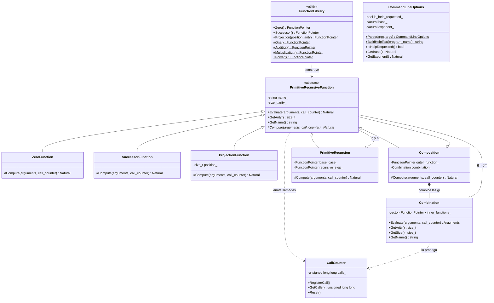
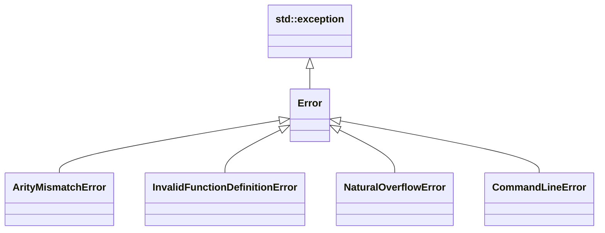

# Práctica 3 — Funciones primitivas recursivas de números naturales

**Asignatura:** Complejidad Computacional · **Curso:** 4.º · **Año académico:** 2026/27
**Autor:** Álvaro Pérez Ramos — `alu0101574042@ull.edu.es`
**Escuela Superior de Ingeniería y Tecnología · Universidad de La Laguna**

**Documentación en GitHub:** [Práctica 3 — Potencia como función primitiva recursiva](https://github.com/AlvaroPerezRamos/Complejidad-Computacional/blob/main/practica_3/PotenciaRecursiva.md)

---

## 1. Objetivo

Calcular `potencia(x, y) = xʸ` **como función primitiva recursiva** de números naturales,
construida únicamente a partir de las funciones básicas (`Z`, `S`, `Pᵢⁿ`) y de las operaciones de
**combinación**, **composición** y **recursión primitiva**. El programa muestra el resultado y el
número de llamadas a funciones realizadas.

> En ninguna función de la librería se usa una operación aritmética del lenguaje (ni `+` ni `*`).
> Todo el cálculo sale de aplicar `S` sucesivamente.

---

## 2. Compilación y ejecución

### Requisitos

| Herramienta | Versión mínima                      |
| ----------- | ----------------------------------- |
| CMake       | 3.10                                |
| Compilador  | C++17 (g++ 9 / clang 10 o superior) |

### Compilación

```bash
cmake -S . -B build
cmake --build build
```

Sin tipo de compilación explícito se usa `Release` (la evaluación hace millones de llamadas). Se
generan dos ejecutables en `build/bin/`: `potencia` (el programa) y `pruebas_unitarias`.

### Ejecución

```
./build/bin/potencia -x <n> -y <n>
```

| Opción         | Obligatoria | Descripción                                                                     |
| -------------- | ----------- | ------------------------------------------------------------------------------- |
| `-x <n>`       | Sí          | Base de la potencia (natural).                                                  |
| `-y <n>`       | Sí          | Exponente de la potencia (natural).                                             |
| `-h`, `--help` | No          | Muestra la ayuda y termina (se resuelve antes que cualquier otra comprobación). |

Las opciones pueden ir en cualquier orden. Cada valor debe ser un natural escrito **solo con
dígitos** que quepa en 64 bits (`0 … 18446744073709551615`); se aceptan ceros a la izquierda
(`007` = `7`).

```bash
./build/bin/potencia -x 2 -y 3
```

```
potencia(2, 3) = 8
Número de llamadas a funciones: 120
```

### Códigos de salida

| Código | Significado                                                                |
| ------ | -------------------------------------------------------------------------- |
| 0      | Correcto (también `-h`).                                                   |
| 1      | Uso incorrecto de la línea de comandos (se muestra el error y la ayuda).   |
| 2      | Desbordamiento: un valor no cabe en 64 bits (ver la nota de la sección 6). |
| 3      | Cualquier otro error propio del programa.                                  |

---

## 3. Definición matemática

**Funciones básicas**

```
Z(x)               = 0
S(x)               = x + 1
Pᵢⁿ(x₁, …, xₙ)     = xᵢ        (1 ≤ i ≤ n)
```

**Operaciones**

- **Combinación** de `g₁, …, gₘ : ℕⁿ → ℕ`: la función `(g₁, …, gₘ) : ℕⁿ → ℕᵐ` que a `x` le asigna
  la tupla `(g₁(x), …, gₘ(x))`.
- **Composición** `h = f ∘ (g₁, …, gₘ)` con `f : ℕᵐ → ℕ`: es «combinar y después aplicar `f`»,
  `h(x) = f(g₁(x), …, gₘ(x))`, `h : ℕⁿ → ℕ`.
- **Recursión primitiva** a partir de `g : ℕⁿ → ℕ` y `h : ℕⁿ⁺² → ℕ`, la función `f : ℕⁿ⁺¹ → ℕ` con

```
  f(x, 0)    = g(x)
  f(x, S(y)) = h(x, y, f(x, y))
```

**Funciones construidas**

```
uno                 = S ∘ (Z)

suma(x, 0)          = P₁¹(x)
suma(x, S(y))       = S ∘ (P₃³) (x, y, suma(x, y))

producto(x, 0)      = Z(x)
producto(x, S(y))   = suma ∘ (P₁³, P₃³) (x, y, producto(x, y))

potencia(x, 0)      = uno(x)
potencia(x, S(y))   = producto ∘ (P₁³, P₃³) (x, y, potencia(x, y))
```

**Convención:** `0⁰ = 1`, que es lo que da `potencia(x, 0) = uno(x)` para todo `x` sin ninguna regla
especial para el cero.

Una potencia es, por tanto, un árbol de funciones:

```
potencia = Rec[ uno , producto ∘ (P₁³, P₃³) ]
producto = Rec[ Z   , suma     ∘ (P₁³, P₃³) ]
suma     = Rec[ P₁¹ , S        ∘ (P₃³)      ]
uno      = S ∘ (Z)
```

---

## 4. Diseño orientado a objetos

### 4.1 Diagrama de clases



`Composition` y `PrimitiveRecursion` son a la vez una función y un agregado de otras funciones
(patrón *Composite*): por eso una potencia es un árbol de objetos cuyas hojas son `Z`, `S` y las
proyecciones. `Combination` **no** hereda de `PrimitiveRecursiveFunction`: devuelve una tupla
(`Arguments`), no un único `Natural`. `CommandLineOptions` sigue el mismo patrón que en P01 y P02.

### 4.2 Jerarquía de excepciones



| Excepción                        | Cuándo se lanza                                                          |
| -------------------------------- | ------------------------------------------------------------------------ |
| `ArityMismatchError`             | Se evalúa una función con un número de argumentos distinto de su aridad. |
| `InvalidFunctionDefinitionError` | Una función se construye con componentes incoherentes (ver sección 6).   |
| `NaturalOverflowError`           | `S` recibe el mayor `Natural`: el sucesor no cabe en 64 bits.            |
| `CommandLineError`               | Uso incorrecto de `-x`/`-y` (el mensaje incluye la ayuda).               |

### 4.3 Flujo de ejecución

```
main
 ├─ CommandLineOptions::Parse(argc, argv)          -> base, exponente (o ayuda)
 ├─ FunctionLibrary::Power()                       -> árbol de funciones
 ├─ CallCounter call_counter
 ├─ potencia->Evaluate({base, exponente}, call_counter)
 │     ├─ comprueba la aridad                     (ArityMismatchError si no cuadra)
 │     ├─ call_counter.RegisterCall()             (una llamada por evaluación)
 │     └─ Compute(...)                            (lo implementa cada subclase)
 └─ imprime resultado y call_counter.GetCalls()
```

`Evaluate` es el **método plantilla**: público, no virtual, y siempre hace lo mismo antes de delegar
en `Compute`. Ninguna subclase puede olvidarse de validar la aridad ni de contar.

### 4.4 Responsabilidad de cada clase

| Clase                        | Responsabilidad                                                               |
| ---------------------------- | ----------------------------------------------------------------------------- |
| `PrimitiveRecursiveFunction` | Interfaz común: nombre, aridad y la plantilla `Evaluate` (aridad + contador). |
| `ZeroFunction`               | `Z(x) = 0`.                                                                   |
| `SuccessorFunction`          | `S(x) = x + 1`; único punto con control de desbordamiento.                    |
| `ProjectionFunction`         | `Pᵢⁿ`; valida `1 ≤ i ≤ n` al construirla.                                     |
| `Combination`                | La tupla `(g₁(x), …, gₘ(x))`; valida que las `gᵢ` existan y compartan aridad. |
| `Composition`                | `f ∘ combinación`; valida que la aridad de `f` sea el tamaño de la tupla.     |
| `PrimitiveRecursion`         | Recursión primitiva; valida que `h` tenga aridad `aridad(g) + 2`.             |
| `FunctionLibrary`            | Fábrica estática de `uno`, `suma`, `producto` y `potencia`.                   |
| `CallCounter`                | Cuenta las llamadas; se pasa explícitamente (no es global).                   |
| `CommandLineOptions`         | Valida `-x`, `-y` y `-h/--help`.                                              |

### 4.5 Decisiones de diseño

- **Recursión evaluada de abajo arriba.** `PrimitiveRecursion` calcula `f(x, y)` con un contador de
  nivel que sube desde 0:

```
  f(x,0) = g(x);  f(x,1) = h(x,0,f(x,0));  f(x,2) = h(x,1,f(x,1));  …  hasta f(x,y)
```

  En cada paso se entrega a `h` la terna `(x, nivel, f(x, nivel))` y se sigue hasta alcanzar `y`.
  Es un bucle, no recursión del lenguaje, de modo que un exponente grande no desborda la pila. El
  recuento de llamadas es el de la definición recursiva literal (ver la sección 5).

- **La combinación es una clase aparte.** Se vio en clase como una operación propia. No puede
  heredar de `PrimitiveRecursiveFunction` porque `Evaluate` devuelve un `Natural` y la combinación
  devuelve una tupla. Tampoco cuenta llamada propia (ver sección 5).

- **Validación al construir, no al evaluar.** Un `P_4^3`, una composición con aridades que no
  encajan o una recursión con `h` de aridad incorrecta se rechazan en el constructor
  (`InvalidFunctionDefinitionError`). Así una función que existe siempre es coherente. Las
  comprobaciones se hacen en funciones auxiliares que se ejecutan **antes** de usar los punteros,
  porque el orden de evaluación de los argumentos del constructor de la clase base no está
  especificado.

- **Punteros.** Las funciones son inmutables y se comparten con
  `std::shared_ptr<const PrimitiveRecursiveFunction>` (`FunctionPointer`). Hacen falta porque
  `Composition`, `Combination` y `PrimitiveRecursion` guardan funciones de tipos distintos que solo
  se conocen en ejecución. Solo se ven en `FunctionLibrary` y en las pruebas: `main` llama a
  `FunctionLibrary::Power()` y no maneja ninguno.

- **Desbordamiento solo en `S`.** Es el único sitio donde un valor puede crecer (`Z` y `Pᵢⁿ`
  devuelven 0 o un argumento ya existente).

- **Contador explícito.** `CallCounter` se pasa por referencia a cada evaluación en lugar de ser una
  variable global: dos evaluaciones no se interfieren y las pruebas pueden medirlas por separado.

---

## 5. Recuento de llamadas

Cada evaluación de una función primitiva recursiva cuenta **una** llamada: `Z`, `S`, cada
proyección, cada composición y cada invocación de una función definida por recursión. El total de
una función es la suma de las llamadas de todas las funciones que contiene.

- **Recursión.** El recuento coincide con el de la definición recursiva literal: para `f(x, y)` se
  invoca `f` en los niveles `y, …, 1, 0` (`y + 1` invocaciones), `g` una vez y `h` `y` veces.
- **Combinación.** No cuenta llamada propia, solo las de las `gᵢ` que evalúa: no es una función
  `ℕⁿ → ℕ` sino una tupla de ellas.

Con esta convención, comprobado contra un evaluador independiente:

| Función          | Llamadas                     | Ejemplo                |
| ---------------- | ---------------------------- | ---------------------- |
| `uno`            | 3                            |                        |
| `suma(x, y)`     | `2 + 4y`                     | `suma(3, 4)` = 18      |
| `producto(x, y)` | `2 + 6y + 2·x·y·(y − 1)`     | `producto(3, 4)` = 98  |
| `potencia(x, 0)` | 4                            | `potencia(5, 0)` = 4   |
| `potencia(x, y)` | (sin fórmula cerrada simple) | `potencia(2, 3)` = 120 |

---

## 6. Gestión de errores

### Línea de comandos (`CommandLineError`, código de salida 1)

Todos los mensajes incluyen la ayuda.

| Situación                                                         | Mensaje                                                                      |
| ----------------------------------------------------------------- | ---------------------------------------------------------------------------- |
| Falta `-x` o `-y`                                                 | `Falta la opción obligatoria '-x'.`                                          |
| Opción repetida                                                   | `La opción '-x' está repetida.` (se detecta **antes** de convertir el valor) |
| Opción sin valor                                                  | `A la opción '-y' le falta el valor.`                                        |
| Opción desconocida o argumento suelto                             | `Opción desconocida: '-z'.`                                                  |
| Valor que no son solo dígitos (`-5`, `+5`, `2.5`, `12abc`, vacío) | `El valor de '-x' debe ser un número natural (solo dígitos) …`               |
| Valor que no cabe en 64 bits                                      | `… no cabe en un natural de 64 bits (máximo 18446744073709551615).`          |

La comprobación de «solo dígitos» va **antes** de convertir: sin ella, una cadena vacía se aceptaría
en silencio como `0` y los mensajes de error serían engañosos.

### Definiciones inválidas (`InvalidFunctionDefinitionError`)

Se lanzan al construir la función. No se pueden provocar desde la línea de comandos: las cubren las
pruebas unitarias.

| Clase                | Situaciones rechazadas                                                      |
| -------------------- | --------------------------------------------------------------------------- |
| `ProjectionFunction` | `i < 1` o `i > n`.                                                          |
| `Combination`        | Lista vacía; función nula; funciones con aridades distintas.                |
| `Composition`        | `f` nula; aridad de `f` distinta del número de funciones de la combinación. |
| `PrimitiveRecursion` | `g` o `h` nulas; aridad de `h` distinta de `aridad(g) + 2`.                 |

### Evaluación

- `ArityMismatchError`: número de argumentos incorrecto. La comprobación ocurre **antes** de anotar
  la llamada, así que una evaluación rechazada no se cuenta.
- `NaturalOverflowError` (código 2): `S` recibe el mayor `Natural`. Está probado en las pruebas
  unitarias, pero **no se puede provocar desde la línea de comandos**: como todo el cálculo avanza
  de uno en uno, superar 2⁶⁴ exigiría del orden de 10¹⁹ operaciones, y el tiempo se agota mucho
  antes (ver la sección 7).

---

## 7. Límites prácticos

`suma` y `producto` están definidas con la recursión de los apuntes, que cuenta de uno en uno. Por
eso el número de llamadas de `potencia` crece **de forma cuadrática en el valor de `xʸ`**:

| Entrada      | Resultado | Llamadas    | Tiempo aprox. (Release) |
| ------------ | --------- | ----------- | ----------------------- |
| `-x 2 -y 10` | 1024      | 1 400 210   | 0,02 s                  |
| `-x 2 -y 12` | 4096      | 22 377 886  | 0,18 s                  |
| `-x 2 -y 14` | 16384     | 357 946 794 | 2,6 s                   |

Un exponente como `-x 2 -y 20` ya no termina en un tiempo razonable. Es una propiedad de las
funciones primitivas recursivas definidas así, no un fallo del programa.

---

## 8. Batería de pruebas

```bash
./test/run_tests.sh                     # usa build/bin/potencia
./test/run_tests.sh ruta/al/ejecutable
```

El script ejecuta 36 comprobaciones:

- **Resultado y número de llamadas** de 11 entradas (incluidos `0⁰`, `x⁰`, `0ʸ`, `7²`, `10⁴`, `3⁸`).
- **Límites del tipo `Natural`:** el mayor natural como base, con `y = 0` y `y = 1`.
- **Orden de las opciones** y **ceros a la izquierda**.
- **17 errores de línea de comandos**, todos con código de salida 1 y la ayuda.
- **Ayuda** (`-h`, `--help`, y que `-h` tenga prioridad sobre un error posterior).
- **Pruebas unitarias** (`build/bin/pruebas_unitarias`): 21 pruebas, 66 comprobaciones, que cubren lo que
  la línea de comandos no puede alcanzar: funciones básicas, plantilla de evaluación (la aridad se
  comprueba antes de contar), definiciones inválidas, `S(máximo)`, y los valores y recuentos de
  `FunctionLibrary`.

Los valores esperados **no salen del propio programa**: se calcularon con un evaluador independiente
en Python que aplica las definiciones de forma literal (recursión real, leyendo `f(x, S(y))` hacia
atrás) y cuenta cada invocación.

---

## 9. Estructura del proyecto

```
practica_3/
├── CMakeLists.txt
├── PotenciaRecursiva.md
├── include/
│   ├── basic_functions.h
│   ├── call_counter.h
│   ├── combination.h
│   ├── command_line_options.h
│   ├── composition.h
│   ├── errors.h
│   ├── function_library.h
│   ├── primitive_recursion.h
│   ├── primitive_recursive_function.h
│   └── types.h
├── src/
│   ├── combination.cc
│   ├── command_line_options.cc
│   ├── composition.cc
│   ├── function_library.cc
│   ├── main.cc
│   ├── primitive_recursion.cc
│   └── primitive_recursive_function.cc
└── test/
    ├── run_tests.sh
    └── unit_tests.cc
```

`basic_functions.h` agrupa `ZeroFunction`, `SuccessorFunction` y `ProjectionFunction`: son clases de
pocas líneas y se definen enteras en la cabecera.

---

## 10. Referencias

1. Material de la asignatura Complejidad Computacional, Universidad de La Laguna (Moodle).
2. Organizar un proyecto C++: <https://www.studyplan.dev/cmake/organizing-a-cpp-project>