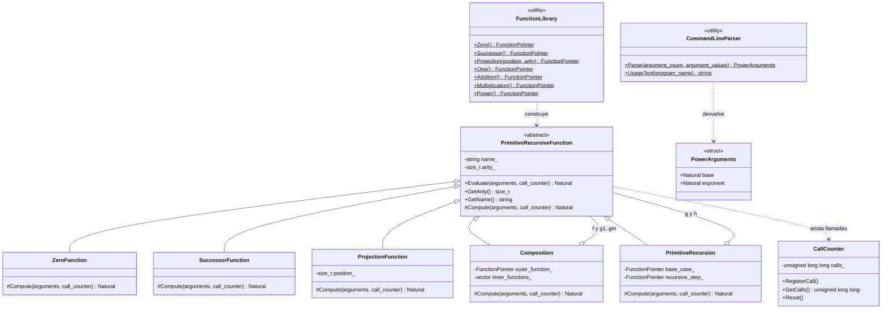

# Práctica 3 — Funciones primitivas recursivas de números naturales

**Asignatura:** Complejidad Computacional · **Curso:** 4.º · **Año académico:** 2026/27
**Autor:** Álvaro Pérez Ramos — `alu0101574042@ull.edu.es`
**Escuela Superior de Ingeniería y Tecnología · Universidad de La Laguna**

---

## 1. Objetivo

Calcular `potencia(x, y) = xʸ` **como función primitiva recursiva** de números naturales, construida únicamente a partir de las funciones básicas (`Z`, `S`, `Pᵢⁿ`) y de las operaciones de composición y recursión. El programa muestra el resultado y el número de llamadas a funciones realizadas.

## 2. Compilación y ejecución

```bash
cmake -S . -B build
cmake --build build
./build/potencia -x 2 -y 3
```

Salida:

```
potencia(2, 3) = 8
Número de llamadas a funciones: 120
```

| Opción   | Significado                                     |
| -------- | ----------------------------------------------- |
| `-x <n>` | base de la potencia (natural, obligatoria)      |
| `-y <n>` | exponente de la potencia (natural, obligatoria) |

Las opciones pueden ir en cualquier orden. Cada valor debe ser un natural escrito solo con dígitos que quepa en 64 bits; en caso contrario se muestra un error y la ayuda de uso.

| Código de salida | Significado                                     |
| ---------------- | ----------------------------------------------- |
| 0                | Correcto                                        |
| 1                | Uso incorrecto de la línea de comandos          |
| 2                | Desbordamiento: el resultado no cabe en 64 bits |
| 3                | Otro error                                      |

Si no se indica tipo de compilación se usa `Release` (la evaluación realiza millones de llamadas).

## 3. Definición matemática

Funciones básicas: `Z(x) = 0`, `S(x) = x + 1`, `Pᵢⁿ(x₁,…,xₙ) = xᵢ`.

Operaciones (notación de los apuntes):

- **Composición:** `h = f ∘ (g₁,…,gₘ)`, `h(x) = f(g₁(x),…,gₘ(x))`. Incluye la *combinación*: la tupla `(g₁(x),…,gₘ(x))` se construye evaluando las `gᵢ` sobre los mismos argumentos.
- **Recursión:** a partir de `g : ℕⁿ → ℕ` y `h : ℕⁿ⁺² → ℕ`, `f : ℕⁿ⁺¹ → ℕ` con
  `f(x, 0) = g(x)` y `f(x, S(y)) = h(x, y, f(x, y))`.

Funciones construidas (solo las necesarias para `potencia`):

```
uno      = S ∘ Z
suma(x, 0)      = P₁¹(x)
suma(x, S(y))   = S ∘ P₃³ (x, y, suma(x, y))
producto(x, 0)  = Z(x)
producto(x, S(y)) = suma ∘ (P₁³, P₃³) (x, y, producto(x, y))
potencia(x, 0)  = uno(x)
potencia(x, S(y)) = producto ∘ (P₁³, P₃³) (x, y, potencia(x, y))
```

`pred` y `resta` **no** son necesarias para calcular `xʸ` y por eso no se implementan. Convención: `0⁰ = 1`, que es lo que da `potencia(x, 0) = uno(x)` para todo `x`.

## 4. Diseño

```
PrimitiveRecursiveFunction            (abstracta: aridad, nombre, Evaluate → Compute)
├── ZeroFunction                      Z
├── SuccessorFunction                 S   (único punto con control de desbordamiento)
├── ProjectionFunction                Pᵢⁿ
├── Composition                       f ∘ (g₁,…,gₘ)
└── PrimitiveRecursion                recursión primitiva (g, h)

FunctionLibrary     fábrica estática: Zero, Successor, Projection, One, Addition,
                    Multiplication, Power
CallCounter         contador de llamadas, pasado explícitamente a cada evaluación
CommandLineParser   validación de -x y -y
```

- **Método plantilla.** `Evaluate()` es público y no virtual: comprueba la aridad, anota **una** llamada y delega en el método virtual protegido `Compute()`. Ninguna subclase puede olvidarse de contar ni de validar.
- **Composición de objetos.** Las funciones son inmutables y se comparten con `std::shared_ptr<const …>`. `Composition` y `PrimitiveRecursion` comprueban en el constructor que las aridades encajan.
- **Sin aritmética del lenguaje.** `FunctionLibrary` solo combina `Z`, `S` y `P`; no hay un `+` ni un `*` en la definición de `suma`, `producto` ni `potencia`.

### 4.1. Diagrama UML de clases



`Composition` y `PrimitiveRecursion` son a la vez una función y un agregado de otras funciones (patrón *Composite*): por eso una potencia es un árbol de objetos cuyas hojas son `Z`, `S` y las proyecciones.

### 4.2. Sobre el «−1»

Leer `f(x, S(y)) = h(x, y, f(x, y))` hacia atrás obligaría a descomponer `y = S(y')`, es decir, a restar 1. `PrimitiveRecursion` lo evita: evalúa **de abajo arriba**,

```
f(x,0) = g(x);  f(x,1) = h(x,0,f(x,0));  …  f(x,y) = h(x,y−1,f(x,y−1))
```

con un contador de nivel que solo sube. Es la misma función y las mismas llamadas, sin ninguna resta y sin recursión del lenguaje (no hay riesgo de desbordar la pila con exponentes grandes). La única expresión «−1» del código es el índice `position_ - 1` de `ProjectionFunction`, que convierte una posición contada desde 1 (como en los apuntes) en un índice de `std::vector`; no opera sobre valores de ℕ.

### 4.3. Qué cuenta como «llamada»

Cada evaluación de **cualquier** función cuenta como una llamada: `Z`, `S`, cada proyección, cada composición y cada invocación de una función definida por recursión. Para `PrimitiveRecursion` el recuento coincide con el de la definición recursiva literal: para `f(x, y)` se invoca `f` en los niveles `y, y−1, …, 0` (`y+1` invocaciones), `g` una vez y `h` `y` veces.

Con esta convención, y comprobado contra un evaluador independiente:

```
uno                 = 3 llamadas
suma(x, y)          = 2 + 4y
producto(x, y)      = 2 + 6y + 2·x·y·(y − 1)
potencia(x, 0)      = 4
potencia(2, 3)      = 120
```

## 5. Límites prácticos

`suma` y `producto` están definidas con la recursión de los apuntes, que cuenta de uno en uno. Por eso el número de llamadas de `potencia` crece **de forma cuadrática en el valor de `xʸ`**:

| Entrada      | Resultado | Llamadas    | Tiempo aprox. (Release) |
| ------------ | --------- | ----------- | ----------------------- |
| `-x 2 -y 10` | 1024      | 1 400 210   | 0,02 s                  |
| `-x 2 -y 12` | 4096      | 22 377 886  | 0,24 s                  |
| `-x 2 -y 14` | 16384     | 357 946 794 | 3,4 s                   |

Un exponente como `-x 2 -y 20` ya no termina en un tiempo razonable. Es una propiedad de las funciones primitivas recursivas definidas así, no un fallo del programa. El control de desbordamiento (código de salida 2) existe, pero con entradas realistas el tiempo se agota mucho antes de llegar a 2⁶⁴.

## 6. Pruebas

```bash
bash test/run_tests.sh            # usa ./build/potencia
bash test/run_tests.sh ruta/al/ejecutable
```

El script comprueba 29 casos: resultado y número de llamadas de 10 entradas (incluidos `0⁰`, `x⁰`, `0ʸ`), orden de las opciones, ceros a la izquierda y 17 errores de línea de comandos (opciones que faltan, repetidas o desconocidas, valores negativos, decimales, con signo, vacíos o que no caben en 64 bits).

Los valores esperados no salen del propio programa: se calcularon con un evaluador independiente en Python que aplica las definiciones de forma literal y cuenta cada invocación.

## 7. Estructura del proyecto

```
practica_3/
├── CMakeLists.txt
├── README.md
├── include/
│   ├── call_counter.h
│   ├── command_line_parser.h
│   ├── composition.h
│   ├── errors.h
│   ├── function_library.h
│   ├── primitive_recursion.h
│   ├── primitive_recursive_function.h
│   ├── projection_function.h
│   ├── successor_function.h
│   ├── types.h
│   └── zero_function.h
├── src/
│   ├── command_line_parser.cc
│   ├── composition.cc
│   ├── function_library.cc
│   ├── main.cc
│   ├── primitive_recursion.cc
│   ├── primitive_recursive_function.cc
│   ├── projection_function.cc
│   ├── successor_function.cc
│   └── zero_function.cc
└── test/
    └── run_tests.sh
```

## 8. Referencias

1. Material de la asignatura Complejidad Computacional, Universidad de La Laguna (Moodle).
2. Organizar un proyecto C++: <https://www.studyplan.dev/cmake/organizing-a-cpp-project>